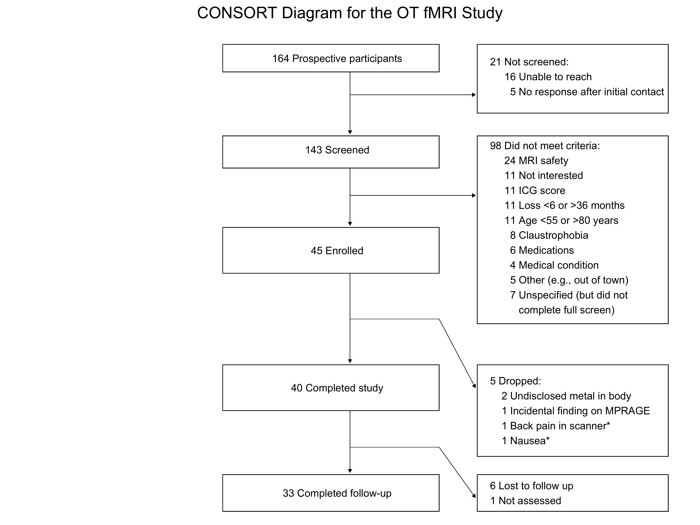

### Making a CONSORT diagram using ggplot2

Based on this very helpful tutorial: https://rpubs.com/phiggins/461686

```{r}
library(tidyverse)

# create an empty 100x100 grid
data <- tibble(x= 0:100, y= 0:100)

data %>% 
  ggplot(aes(x, y)) +
  scale_x_continuous(minor_breaks = seq(10, 100, 10)) +
  scale_y_continuous(minor_breaks = seq(10, 100, 10)) +
  theme_linedraw() ->
  p
p

# for everything that follows, you will use x/y, xmin/ymin, and xmax/ymax values to resize and arrange elements as you wish, using the grid coordinates as reference
# also, because R is weird about how it displays graphics (e.g., making the image bigger does NOT just scale everything up, including enlarging any text), you'll notice that some of the text overflows its box when displayed in RStudio
# that's because I went back and optimized the text size for when I save it out as high-res PNG file at the end

# add the first box and text
p +
  geom_rect(xmin = 30, xmax=64, ymin=94, ymax=100, color='black',
            fill='white', size=0.25) +
  annotate('text', x=48, y=97,label= '164 Prospective participants', size=3) ->
  p

# then add some more boxes and text: those not screened and those excluded
p +
  geom_rect(xmin = 30, xmax=64, ymin=73, ymax=80, color='black',
            fill='white', size=0.25) +
  annotate('text', x = 48, y=77,label= '143 Screened', size=3) +
  geom_rect(xmin = 70, xmax=100, ymin=85, ymax=100, color='black',
            fill = 'white', size=0.25) +
  annotate('text', x= 72, y=93, hjust=0, label= '21 Not screened: \n     16 Unable to reach \n       5 No response after initial contact', size=3) +
  geom_rect(xmin = 70, xmax=100, ymin=39, ymax=80, color='black',
            fill='white', size=0.25) +
  annotate('text', x= 72, y=60, hjust=0, label= '98 Did not meet criteria:\n     24 MRI safety \n     11 Not interested \n     11 ICG score \n     11 Loss <6 or >36 months \n     11 Age <55 or >80 years \n       8 Claustrophobia  \n       6 Medications \n       4 Medical condition \n       5 Other (e.g., out of town) \n       7 Unspecified (but did not\n          complete full screen)', size=3)  ->
  p2
p2

# add a third box: n participants enrolled
p2 + geom_rect(xmin = 30, xmax=64, ymin=50, ymax=60, color='black',
            fill='white', size=0.25) +
  annotate('text', x= 48, y=55,label= '45 Enrolled', size=3) -> p3

p3

# and some more boxes with n completers/n drops
p3 +
  geom_rect(xmin = 30, xmax=64, ymin=20, ymax=30, color='black',
            fill='white', size=0.25) +
  annotate('text', x= 48, y=25,label= '40 Completed study', size=3) +
  geom_rect(xmin = 70, xmax=100, ymin=10, ymax=30, color='black',
            fill='white', size=0.25) +
  annotate('text', x= 72, y=20, hjust=0, label= '5 Dropped: \n    2 Undisclosed metal in body \n    1 Incidental finding on MPRAGE \n    1 Back pain in scanner* \n    1 Nausea*', size=3) -> p4

p4

# finally, the last boxes: those who completed follow-up and those who did not
p4 +
  geom_rect(xmin = 30, xmax=64, ymin=-2, ymax=6, color='black',
            fill='white', size=0.25) +
  annotate('text', x= 48, y=2,label= '33 Completed follow-up', size=3) +
  geom_rect(xmin = 70, xmax=100, ymin=-2, ymax=6, color='black',
            fill='white', size=0.25) +
  annotate('text', x= 72, y=2, hjust=0, label= '6 Lost to follow up \n1 Not assessed', size=3) -> p5

p5

# now time to add the arrows
# in the following, x and y = the point on the plot where the arrow starts
# the point where the arrow finishes is defined by xend and yend
p5+ 
  geom_segment(
  # first vertical arrow
    x=50, xend=50, y=94, yend=80.5, 
    size=0.15, linejoin = "mitre", lineend = "butt",
    arrow = arrow(length = unit(1, "mm"), type= "closed")) +
  # first horizonal arrow
  geom_segment(
    x=50, xend=69.7, y=89, yend=89, 
    size=0.15, linejoin = "mitre", lineend = "butt",
    arrow = arrow(length = unit(1, "mm"), type= "closed")) +
  # second vertical arrow
  geom_segment(
    x=50, xend=50, y=73, yend=60.5, 
    size=0.15, linejoin = "mitre", lineend = "butt",
    arrow = arrow(length = unit(1, "mm"), type= "closed")) +
  # second horizonal arrow
 geom_segment(
    x=50, xend=69.7, y=67, yend=67, 
    size=0.15, linejoin = "mitre", lineend = "butt",
    arrow = arrow(length = unit(1, "mm"), type= "closed")) +
  # third vertical arrow
  geom_segment(
    x=50, xend=50, y=50, yend=30.5, 
    size=0.15, linejoin = "mitre", lineend = "butt",
    arrow = arrow(length = unit(1, "mm"), type= "closed")) +
  # diagonal arrow
 geom_segment(
    x=64, xend=69.7, y=40, yend=25, 
    size=0.15, linejoin = "mitre", lineend = "butt",
    arrow = arrow(length = unit(1, "mm"), type= "closed")) +
  # short horizonal line, no arrow
 geom_segment(
    x=50, xend=64, y=40, yend=40, 
    size=0.15, linejoin = "mitre", lineend = "butt") +
# fourth vertical arrow
  geom_segment(
    x=50, xend=50, y=20, yend=6.5, 
    size=0.15, linejoin = "mitre", lineend = "butt",
    arrow = arrow(length = unit(1, "mm"), type= "closed")) +
  # 2nd diagonal arrow
 geom_segment(
    x=64, xend=69.7, y=12, yend=1, 
    size=0.15, linejoin = "mitre", lineend = "butt",
    arrow = arrow(length = unit(1, "mm"), type= "closed")) +
  # 2nd short horizonal line, no arrow
 geom_segment(
    x=50, xend=64, y=12, yend=12, 
    size=0.15, linejoin = "mitre", lineend = "butt") +
  # then get rid of the grid...
  theme_void() +
  # ...and add a title (centered)
  ggtitle("CONSORT Diagram for the OT fMRI Study") +
theme(plot.title = element_text(hjust=.5)) -> p6
p6
# finally...save it as a high-resolution (dpi=600) PNG file
# width and height are in inches
# you'll have to play around with those (as well as the text size, potentially) to see which make your plot look best
ggsave("consort.png", plot = p6, dpi=600, width = 8, height = 6)
```


The saved file looks like this:



